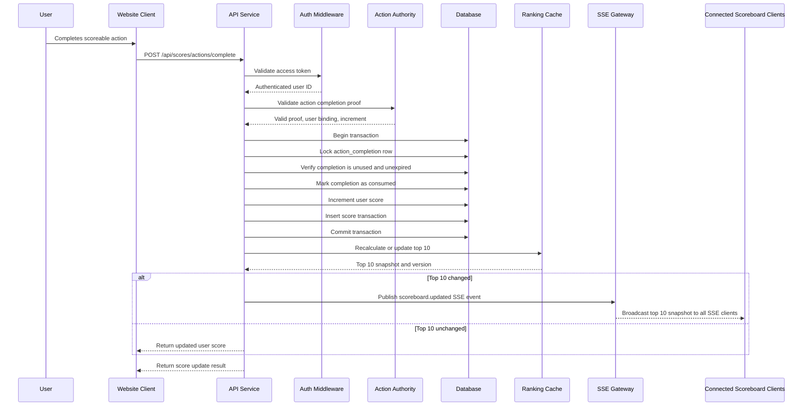

# Live Scoreboard API Module Specification

## 1. Overview

This document specifies a backend API module for maintaining and broadcasting a live top-10 user scoreboard.

The module receives score update requests after users complete authorized actions, validates that the score increase is legitimate, persists the new score, recalculates the top 10 leaderboard, and pushes live updates to connected clients.

The implementation target is the API service / backend application server.

## 2. Goals

- Show the top 10 users by score on the website scoreboard.
- Update the scoreboard live when scores change.
- Allow score increases only after a valid authorized action completion.
- Prevent malicious users from directly increasing their own scores.
- Provide a clear backend contract for API, persistence, validation, and realtime delivery.

## 3. Non-Goals

- Defining the business logic of the user action itself.
- Implementing the frontend scoreboard UI.
- Supporting manual score edits from users.
- Supporting negative scores or score transfers between users.

## 4. Actors

- **User**: Authenticated website user who performs an action.
- **Client Application**: Website frontend that calls the API after action completion and subscribes to live scoreboard updates.
- **API Service**: Backend application server that validates requests, updates scores, and publishes leaderboard changes.
- **Action Authority**: Trusted backend component or service that can prove an action was completed. This may be the same API service if action completion is handled internally.
- **Realtime Gateway**: Server-Sent Events layer used to broadcast scoreboard changes to all connected clients.
- **Database / Cache**: Persistent storage and optional ranking cache used by the API service.

## 5. Core Requirements

### 5.1 Scoreboard

- The scoreboard must return the top 10 users sorted by score descending.
- Ties should be ordered deterministically, for example:
  1. Higher score first.
  2. Earlier time reaching that score first.
  3. Lower user ID or stable unique ID as final tie-breaker.
- The scoreboard response should include enough information for display:
  - Rank
  - User ID
  - Display name
  - Score
  - Last score update timestamp

### 5.2 Live Updates

- Clients must be able to subscribe to scoreboard updates.
- When a committed score update changes the top 10 leaderboard, the API service must publish the new top 10 snapshot.
- The broadcast payload should be a complete top 10 snapshot, not only a delta, so clients can recover from missed events.
- Events should include a monotonically increasing version or timestamp to let clients ignore stale updates.

### 5.3 Score Updates

- Score changes must happen only through a backend-validated score update endpoint or internal command.
- The client must not be trusted to submit arbitrary score increments.
- Each score update must be tied to a completed action proof, such as:
  - A server-issued action completion ID.
  - A signed one-time completion token.
  - A backend-to-backend event from a trusted action service.
- Each action completion may be used only once for scoring.

### 5.4 Security

- The score update endpoint must require authentication.
- The authenticated user must match the user bound to the action completion proof.
- The API service must validate that:
  - The action completion proof is authentic.
  - The proof has not expired.
  - The proof has not already been consumed.
  - The score increment matches the action type or server-side rule.
- The system must apply rate limits and abuse detection to score update requests.
- Failed authorization attempts should be logged with enough context for investigation.

## 6. Proposed API Contract

### 6.1 Get Current Scoreboard

```http
GET /api/scoreboard/top
Authorization: Bearer <access_token>
```

#### Response

```json
{
  "version": 1842,
  "generatedAt": "2026-05-10T10:15:30.000Z",
  "entries": [
    {
      "rank": 1,
      "userId": "user_123",
      "displayName": "Alex",
      "score": 9800,
      "lastUpdatedAt": "2026-05-10T10:14:51.000Z"
    }
  ]
}
```

### 6.2 Submit Completed Action for Score Update

```http
POST /api/scores/actions/complete
Authorization: Bearer <access_token>
Content-Type: application/json
Idempotency-Key: <uuid>
```

#### Request

```json
{
  "actionCompletionId": "actcmp_789",
  "completionToken": "signed-one-time-token"
}
```

#### Response

```json
{
  "userId": "user_123",
  "score": 9850,
  "increment": 50,
  "scoreUpdatedAt": "2026-05-10T10:16:00.000Z",
  "scoreboardVersion": 1843,
  "top10Changed": true
}
```

#### Error Responses

| Status | Code | Meaning |
| --- | --- | --- |
| `400` | `INVALID_REQUEST` | Missing or malformed request fields. |
| `401` | `UNAUTHENTICATED` | Missing or invalid access token. |
| `403` | `ACTION_NOT_AUTHORIZED` | Action proof does not belong to authenticated user. |
| `409` | `ACTION_ALREADY_CONSUMED` | Action completion was already used for scoring. |
| `422` | `ACTION_NOT_SCOREABLE` | Action exists but is not eligible for score increase. |
| `429` | `RATE_LIMITED` | Too many requests or suspicious retry pattern. |

### 6.3 Live Scoreboard Subscription Using Server-Sent Events

The module must use Server-Sent Events (SSE) to push score updates to all connected website clients.

```http
GET /api/scoreboard/stream
Authorization: Bearer <access_token>
Accept: text/event-stream
```

#### Response Headers

```http
HTTP/1.1 200 OK
Content-Type: text/event-stream
Cache-Control: no-cache, no-transform
Connection: keep-alive
X-Accel-Buffering: no
```

`X-Accel-Buffering: no` is recommended when the API service is behind Nginx so events are flushed immediately.

#### Event Format

Each leaderboard update must be sent as a named SSE event:

```text
id: 1843
event: scoreboard.updated
data: {"version":1843,"generatedAt":"2026-05-10T10:16:00.000Z","entries":[{"rank":1,"userId":"user_123","displayName":"Alex","score":9850,"lastUpdatedAt":"2026-05-10T10:16:00.000Z"}]}

```

The `id` field must match the scoreboard `version`. Clients should send the latest received event ID using the standard `Last-Event-ID` header when reconnecting.

#### Event Payload Data

```json
{
  "version": 1843,
  "generatedAt": "2026-05-10T10:16:00.000Z",
  "entries": [
    {
      "rank": 1,
      "userId": "user_123",
      "displayName": "Alex",
      "score": 9850,
      "lastUpdatedAt": "2026-05-10T10:16:00.000Z"
    }
  ]
}
```

#### Heartbeat Event

The server should send a heartbeat comment every 15-30 seconds to keep intermediaries and browsers from closing idle connections:

```text
: heartbeat

```

## 7. Data Model

### 7.1 `users`

| Field | Type | Notes |
| --- | --- | --- |
| `id` | string / uuid | Primary key. |
| `display_name` | string | Public scoreboard name. |
| `created_at` | timestamp | User creation time. |

### 7.2 `user_scores`

| Field | Type | Notes |
| --- | --- | --- |
| `user_id` | string / uuid | Primary key and foreign key to `users.id`. |
| `score` | bigint | Current total score. |
| `last_updated_at` | timestamp | Last successful score change. |
| `score_version` | bigint | Incremented on each score change. |

### 7.3 `action_completions`

| Field | Type | Notes |
| --- | --- | --- |
| `id` | string / uuid | Primary key. |
| `user_id` | string / uuid | User who completed the action. |
| `action_type` | string | Used to determine score increment. |
| `score_increment` | integer | Server-issued increment. |
| `status` | enum | `pending`, `completed`, `consumed`, `expired`, `rejected`. |
| `completed_at` | timestamp | When action was completed. |
| `consumed_at` | timestamp nullable | When score was awarded. |
| `expires_at` | timestamp | Expiration for score claim. |
| `proof_hash` | string nullable | Hash of signed completion token or proof. |

### 7.4 `score_transactions`

| Field | Type | Notes |
| --- | --- | --- |
| `id` | string / uuid | Primary key. |
| `user_id` | string / uuid | User receiving score. |
| `action_completion_id` | string / uuid | Unique reference to prevent replay. |
| `increment` | integer | Awarded score amount. |
| `score_before` | bigint | Previous score. |
| `score_after` | bigint | New score. |
| `created_at` | timestamp | Transaction time. |
| `idempotency_key` | string | Unique per user/request where applicable. |

### 7.5 `scoreboard_versions`

| Field | Type | Notes |
| --- | --- | --- |
| `id` | bigint | Monotonically increasing version. |
| `generated_at` | timestamp | Version creation time. |

## 8. Execution Flow



## 9. Backend Processing Rules

### 9.1 Request Validation

1. Validate JSON schema and required fields.
2. Validate authentication token.
3. Resolve authenticated `user_id`.
4. Validate `Idempotency-Key` format when supplied.
5. Reject requests with unsupported action proof format.

### 9.2 Authorization and Anti-Replay

1. Fetch the action completion record or verify the signed token.
2. Confirm the action belongs to the authenticated user.
3. Confirm the action is complete and scoreable.
4. Confirm the action has not expired.
5. Lock the action completion record inside a transaction.
6. Confirm the action has not already been consumed.
7. Mark the action as consumed before or atomically with the score update.

### 9.3 Score Update Transaction

The score update must be atomic:

1. Lock the score row for the user.
2. Store `score_before`.
3. Add the server-determined increment.
4. Store `score_after`.
5. Insert a `score_transactions` record.
6. Commit all changes together.

If any step fails, the transaction must roll back and no score should be awarded.

### 9.4 Leaderboard Calculation

The module may use one of two approaches:

- **Database-first**: Query the top 10 from `user_scores` after each committed update. This is simpler and acceptable for moderate traffic with proper indexes.
- **Cache-first**: Maintain a sorted set in Redis or equivalent and query the top 10 from the cache. This is preferred for high traffic and frequent live updates.

Recommended database index:

```sql
CREATE INDEX idx_user_scores_score_rank
ON user_scores (score DESC, last_updated_at ASC, user_id ASC);
```

If Redis is used, the database remains the source of truth. The cache must be rebuildable from persisted scores.

## 10. Realtime Delivery with Server-Sent Events

### 10.1 Event Publishing

- Publish only after the database transaction commits.
- Publish a full scoreboard snapshot with `version`.
- Do not publish uncommitted or speculative score changes.
- Use an outbox table if the service needs stronger reliability between database commits and realtime publishing.
- Broadcast the same `scoreboard.updated` event to every currently connected SSE client.
- Flush the HTTP response after each event so clients receive updates immediately.

### 10.2 Client Recovery

- Clients should call `GET /api/scoreboard/top` on initial load.
- Clients should subscribe to `/api/scoreboard/stream` after initial load.
- If a client receives an event with a version lower than or equal to the latest version it has rendered, it should ignore the event.
- If the stream disconnects, the browser `EventSource` client should reconnect automatically.
- On reconnect, the client should provide `Last-Event-ID` automatically when available.
- If the server cannot replay missed events, the client should fetch `GET /api/scoreboard/top` after reconnect and then continue listening.

### 10.3 SSE Connection Management

- Keep one long-lived HTTP connection per connected client.
- Authenticate the connection before opening the stream.
- Remove disconnected clients from the in-memory subscriber list immediately when the request closes.
- Send heartbeat comments every 15-30 seconds.
- Set proxy and load balancer timeouts high enough for long-lived streaming requests.
- Disable proxy buffering for the SSE endpoint.
- If the API service runs multiple instances, use Redis Pub/Sub, a message broker, or a shared event bus so each instance can broadcast updates to its own connected clients.

### 10.4 SSE Limitations

- SSE is one-way from server to client. This is acceptable for scoreboard updates because clients only need to receive updates after submitting score changes through normal HTTP APIs.
- Browsers limit concurrent HTTP connections per origin, especially on HTTP/1.1. Prefer HTTP/2 in production.
- If private per-user realtime commands are needed later, WebSocket may be considered separately, but it is not required for this scoreboard module.

## 11. Security Controls

### 11.1 Required Controls

- Use short-lived access tokens for user authentication.
- Bind every action completion proof to a specific user ID.
- Make action completion proofs one-time use.
- Store consumed action completions to prevent replay.
- Never accept score increments directly from the client.
- Use server-side action-to-score rules.
- Enforce rate limits per user ID, IP address, and device/session where available.
- Log repeated failed attempts and suspicious replay attempts.

### 11.2 Completion Token Recommendation

If using signed completion tokens, include these claims:

```json
{
  "tokenType": "score_action_completion",
  "actionCompletionId": "actcmp_789",
  "userId": "user_123",
  "actionType": "daily_challenge",
  "scoreIncrement": 50,
  "issuedAt": 1778408100,
  "expiresAt": 1778408400,
  "nonce": "random-unique-value"
}
```

The API service must verify the signature and still check server-side storage to ensure the token has not been consumed.

### 11.3 Abuse Detection

Recommended signals:

- Many invalid completion tokens from one user or IP.
- Repeated attempts to reuse consumed action IDs.
- Score updates at impossible frequency.
- Large score movement inconsistent with action rules.
- Multiple accounts from the same device or network showing coordinated behavior.

## 12. Reliability and Consistency

- Score updates must be strongly consistent for each user.
- Duplicate requests with the same action completion should not award duplicate points.
- Duplicate requests with the same `Idempotency-Key` should return the original result when possible.
- Realtime delivery may be eventually consistent, but clients must be able to recover with the snapshot endpoint.
- Leaderboard cache failures should not corrupt scores. If cache update fails, the service should retry or rebuild from the database.

## 13. Observability

### 13.1 Logs

Log the following:

- Score update success with user ID, action completion ID, increment, and transaction ID.
- Authorization failures.
- Replay attempts.
- Rate limit rejections.
- Realtime publish failures.

Do not log raw access tokens or raw completion tokens.

### 13.2 Metrics

Recommended metrics:

- `score_update_requests_total`
- `score_update_success_total`
- `score_update_failure_total`
- `score_update_replay_rejected_total`
- `scoreboard_top10_changed_total`
- `scoreboard_publish_latency_ms`
- `scoreboard_sse_connected_clients`
- `scoreboard_sse_reconnect_total`
- `scoreboard_sse_publish_failure_total`
- `scoreboard_cache_rebuild_total`

### 13.3 Alerts

Recommended alerts:

- Sudden increase in replay attempts.
- Score update failure rate above threshold.
- Realtime publish failures.
- Cache rebuild failures.
- Unusually high score growth for one user or cohort.

## 14. Suggested Implementation Architecture

```text
api-service
├── controllers
│   ├── scoreboard-controller
│   └── score-action-controller
├── services
│   ├── score-service
│   ├── action-proof-service
│   ├── leaderboard-service
│   └── realtime-scoreboard-publisher
├── repositories
│   ├── user-score-repository
│   ├── action-completion-repository
│   └── score-transaction-repository
└── middleware
    ├── authentication
    ├── rate-limit
    └── request-id
```

### 14.1 Module Responsibilities

- `score-action-controller`: Handles HTTP request/response for score updates.
- `score-service`: Owns the atomic score update transaction.
- `action-proof-service`: Validates action completion proof and user binding.
- `leaderboard-service`: Calculates and versions the top 10 scoreboard.
- `realtime-scoreboard-publisher`: Publishes committed leaderboard snapshots.
- `scoreboard-controller`: Serves the current top 10 snapshot and stream endpoint.

## 15. Testing Requirements

### 15.1 Unit Tests

- Valid score update increases score once.
- Reusing the same action completion is rejected.
- Completion proof for another user is rejected.
- Expired completion proof is rejected.
- Client-provided score increment is ignored or rejected.
- Tie-breaking produces deterministic rank order.

### 15.2 Integration Tests

- Database transaction rolls back on failure.
- Concurrent requests for the same action completion award points only once.
- Top 10 recalculates correctly after score changes.
- Realtime event is published only after commit.
- Snapshot endpoint returns the same version as the latest broadcast.

### 15.3 Security Tests

- Missing auth token returns `401`.
- Tampered completion token returns `403`.
- Replay attack returns `409`.
- High-frequency invalid requests trigger rate limit.
- Logs do not contain raw secrets.

## 16. Open Questions for Engineering

- Is the action completion generated by the same API service or by another trusted backend service?
- What SSE fan-out mechanism should be used when the API service runs multiple instances: Redis Pub/Sub, message broker, or platform-managed event bus?
- What is the expected peak rate of score updates per second?
- Should anonymous users be allowed to view the scoreboard?
- Are display names immutable for leaderboard snapshots, or should historical names be updated when users rename themselves?
- What score increments apply to each action type?

## 17. Additional Improvement Comments

- Prefer a backend-to-backend action completion event over a client-submitted completion token when possible. It reduces the attack surface because the browser never handles score-granting proof.
- Use an outbox pattern if losing a realtime event after a successful database commit is unacceptable. The snapshot endpoint already provides recovery, but outbox processing improves delivery reliability.
- Keep an append-only `score_transactions` table even if only current scores are displayed. It is essential for audits, fraud investigation, and score repair.
- Consider a moderation/admin workflow to freeze or adjust suspicious accounts, but keep that separate from the user-facing score update API.
- Avoid broadcasting personal or sensitive user data in scoreboard events. Only include fields required by the public scoreboard UI.
- Add a background reconciliation job that periodically rebuilds the leaderboard cache from the database and compares versions or top 10 output.
- Define score limits per action type and per time window. Authorization alone prevents simple forgery, but rate and frequency rules help detect compromised accounts.
